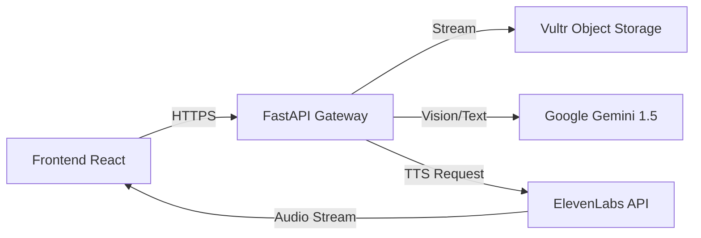

# ⚡ Optima: Multimodal Data Curation Platform

> **Hackathon Project 2025** | Powered by **Vultr, Gemini 1.5 & ElevenLabs**


## 🌐 Live Demo

* **Production:** __http://tortadetamal.fit/__
* **Vultr:** __http://45.77.163.127__
* **API:** __http://45.77.163.127:8000/docs__

---

## 📖 Descripción

**Optima** es una plataforma de ingeniería de datos autónoma diseñada para auditar, limpiar y estructurar datasets no estructurados (imágenes, PDFs, audio) en segundos.

Utiliza **Gemini 1.5 Pro** para detectar sesgos éticos (género, raza, edad) y calidad técnica, **Vultr Cloud** para el procesamiento escalable, y **ElevenLabs** para ofrecer una interfaz de voz humana que explica los hallazgos al usuario.

---

## 🏗️ Arquitectura del Sistema

El sistema sigue una arquitectura desacoplada (Headless) con almacenamiento de objetos en la nube.



---

## 🚀 Stack Tecnológico

* **Infraestructura:** Vultr Cloud Compute (VPS) & Vultr Object Storage (S3).
* **IA Core:** Google Gemini 1.5 Flash (Visión/STT) & Pro (Razonamiento).
* **Voz:** ElevenLabs (Text-to-Speech Streaming).
* **Backend:** Python FastAPI, Uvicorn.
* **Frontend:** React, Tailwind CSS, Recharts, Lucide React.

---

## 📂 Estructura del Repositorio

```bash
/optima
├── /backend          # API Python (FastAPI + Lógica IA)
│   ├── main.py       # Endpoints principales
│   ├── gemini_service.py # Integración Multimodal
│   └── tts_service.py    # Streaming de voz
├── /frontend         # UI React (Vite)
│   ├── src/          # Componentes y Lógica
│   └── public/       # Assets estáticos
└── README.md         # Documentación General
```

---

## 🏁 Quick Start (Modo Desarrollo)

Para correr todo el proyecto localmente:

### Backend:

```bash
cd backend
python -m venv venv
source venv/bin/activate  # o .\venv\Scripts\activate en Windows
pip install -r requirements.txt
uvicorn main:app --reload
```

### Frontend:

```bash
cd frontend
npm install
npm run dev
```

Accede a **http://localhost:5173**

---

